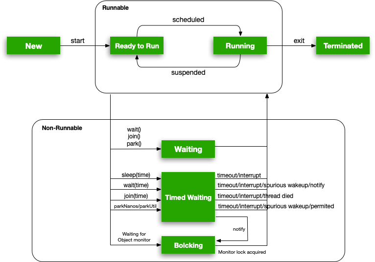

# 线程的一生

线程是 CPU 调度的基本单位。Java 中线程状态分为 6 种：

* New：创建状态
* Runnable：可运行状态
* Waiting：等待状态
* Timed Waiting：限时等待状态
* Blocking：阻塞状态
* Terminated：结束状态

[Thread.State](https://docs.oracle.com/javase/8/docs/api/java/lang/Thread.State.html) 中介绍了各个状态的含义。

## Runable

**创建（new）** 后的线程对象，调用 `Thread.start()` 方法进入 **可运行（Runnable）** 状态。

**可运行** 线程并没有立即执行，而是分为了两步：ready to run 和 running。因为线程进入可运行状态后仍然需要等待某些资源，最常见的是等待 CPU 调度资源或 IO 资源。

线程执行结束后，进入了 **结束（Terminated）** 状态。

## Waiting

线程会以 3 种不同方式进入 **等待（Waiting）** 状态，然后以各自的方式被唤醒。唤醒后的线程并没有直接进入 **可运行** 状态，而是参与了锁竞争。下面详细的介绍了这个过程。

>   任何处于等待状态下的线程，均允许响应中断。但是，仍然需要参与锁竞争，获得锁权限后才会抛出 [InterruptedException](https://docs.oracle.com/javase/8/docs/api/java/lang/InterruptedException.html)。
>

### Object.wait()

`Object.wait()` 调用后，线程需要先放弃对象锁（若事先未获得锁，则抛出 [IllegalMonitorStateException](https://docs.oracle.com/javase/8/docs/api/java/lang/IllegalMonitorStateException.html)），然后被推进 **线程等待队列（Thread Waiting Set**），等待其他线程的唤醒。

其他线程调用 `Object.notify()` 会 **随机** 唤醒等待队列中的一个线程。为了公平性，该线程并没有直接进入可运行状态，而是重新开始了锁竞争，成功获取锁权限后才进入可运行状态。否则，线程会因为竞争锁失败而进入 **阻塞（Blocking）**，一直到获取锁权限。

`Object.notifyAll()` 会唤醒等待队列中的所有线程，后续过程与 `Object.wait()` 相同。

特别注意：

1. 等待线程仍然可以响应中断，但是需要竞争到锁权限后才会抛出 [InterruptedException](https://docs.oracle.com/javase/8/docs/api/java/lang/InterruptedException.html)

2. 等待线程有可能（概率尽管很小）出现 **意外唤醒（Surprise Wakeup）**，因此通常在循环中调用 `wait()` 方法

3. ```java
    private final Object object = new Object();
    ....
    synchronized (object) {
        while (condition) {
            object.wait();
        }
    }
    ```

### Thread.join()

Thread.join() 方法是为了等待某一个线程进入 **终止（Terminated）** 状态，当线程执行完毕，等待结束。

```java
Thread t = new Thread();
t.start();
// waiting for t finished.
t.join();
```

`Thread.join()` 的底层原理是基于 `Object.wait()` 实现的，通过循环判断线程是否存活来决定是否继续等待。

```java
public final synchronized void join(long millis) {
    ...
    while (isAlive()) {
        wait(delay);
    }
    ...
}
```

### LockSupport.park()

[LockSupport](https://docs.oracle.com/javase/8/docs/api/java/util/concurrent/locks/LockSupport.html) 是 Java 中用于支持 **线程阻塞原语（Thread Blocking Primitives，又称 PV 原语）** 的基础工具类，位于 java.util.concurrent.locks 包下。`Lock` 与 `Condition` 都是基于 LockSupport 实现的。

```java
Lock lock = new ReentrantLock();
Condition cond = lock.newCondition();
```

PV 原语用于空闲资源申请和释放，P 操作用于申请一个空闲资源，V 操作用于释放空闲资源，[操作系统的线程管理](./操作系统的线程管理.md) 中介绍了 PV 原语的作用和原理。

`park` 方法等同于 P 操作，`unpark` 等同于 V 操作。调用 `park` 方法无法获取空闲资源时，线程会进入等待状态，直到其他线程调用 `unpark` 方法释放资源。

特别注意的是，park 方法进入的等待的线程，有可能被意外唤醒（与 Object.wait() 中的意外唤醒相同），为了安全起见，通常都会在循环中调用。

```java
while (condition) {
    LockSupport.park(this);
}
```

## Timed Waiting

**限时等待（Timed Waiting）** 与 **等待（Waiting）** 状态相似，但是它可以在超时后在没有外界的影响下自我唤醒。

下面是关于各个限时等待方法的参数对于边界值的处理方式：

|                       |        等于 0        |                            小于 0                            |
| :-------------------: | :------------------: | :----------------------------------------------------------: |
| Thread.sleep(millis)  |       立即唤醒       | [IllegalArgumentException](https://docs.oracle.com/javase/8/docs/api/java/lang/IllegalArgumentException.html) |
|  Thread.join(millis)  |   与 `jion()` 相同   | [IllegalArgumentException](https://docs.oracle.com/javase/8/docs/api/java/lang/IllegalArgumentException.html) |
| Object.wait(timeout)  |    与 wait() 相同    | [IllegalArgumentException](https://docs.oracle.com/javase/8/docs/api/java/lang/IllegalArgumentException.html) |
| LockSupport.parkNanos | 无任何操作，直接返回 |                     无任何操作，直接返回                     |
| LockSupport.parkUtil  | 无任何操作，直接返回 |                     无任何操作，直接返回                     |

注：使用 LockSupport.parkNanos 和 LockSupport.parkUtil 时 **必须** 保证等待参数大于 0，否则方法无效。

## Terminated

执行完任务的线程，会进入 **结束（Terminated）** 状态。

以下是 Java 线程状态变化流程图。



## Tick, Tick

线程状态是 Java 多线程“游戏”中的基本规则。本篇重点讲解的线程等待与唤醒，恰恰是这场游戏中最复杂、最关键的一环。Java 中诸多熟知的多线程工具，例如：可重入锁、Condition、Thread.join 等都是基于线程等待实现的。

## 扩展阅读

[操作系统的线程管理](./操作系统的线程管理.md)

[Life Cycle of a Thread in Java | Baeldung](https://www.baeldung.com/java-thread-lifecycle)

[AQS的原理浅析| 并发编程网– ifeve.com](http://ifeve.com/java-special-troops-aqs/)

## 版权声明

<a rel="license" href="http://creativecommons.org/licenses/by-nc/4.0/"></a>本作品采用<a rel="license" href="http://creativecommons.org/licenses/by-nc/4.0/">知识共享署名-非商业性使用 4.0 国际许可协议</a>进行许可。

<p align="center">
  <br />感谢支持！
</p>